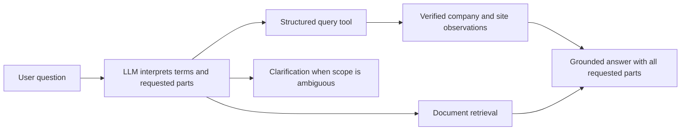

**GNEM repository review and recommended next steps — 11 September 2026**

Reviewed revision: `8e7196e` (GNEM v3). Historical reference: `v2-frozen-reference`, `b18313ae593995e8d415880603b3d355dd695ebd`.

**Recommendation**

Keep the v3 data foundation and its emphasis on controlled evaluation. Do not start the full training matrix yet. First close the outstanding implementation findings and decide how the research experiment connects to the assistant you actually want to deliver.

For reliable company questions and multiple aggregate operations, build an LLM connected to an authoritative structured database. Fine-tune question interpretation, domain terminology, query/tool use, clarification, and grounded explanation when evaluation shows that tuning helps. Exact company facts and numerical computation should remain available through tools. A model can learn facts and numerical patterns in its weights, but fine-tuning does not make those weights an exact, updateable database.

The present repository is a research experiment asking which knowledge is learned in weights versus accessed externally. It is not yet a complete EV supply-chain assistant, and its deliberate capability holdouts are not an appropriate final production training recipe.

**What I inspected and what this review establishes**

I inventoried all 81 project files, excluding Git internals, the installed `.venv-v3` environment, and generated bytecode. This includes 31 Python modules, the workbook, database, every JSON/JSONL/CSV artifact, documentation, validation fixtures, and both conversation transcripts. I parsed all Python files and structured text artifacts, examined the implementation and generated-data coverage, and ran targeted regression suites in a separate `/tmp` copy. The appendix accounts for every inventoried file. Transcript review was for decisions and audit history; this is not a claim that every sentence in the approximately 32,000 transcript lines was independently fact-checked.

I inspected the historical v2 report through Git, including its methodological caveats. Historical result figures below are reported evidence, not a rerun or independent regrading of v2. I did not run model training, model inference, or sealed v3 test/Q42 evaluation. No pre-existing project artifact changed during this review; all 81 original file hashes still matched the initial inventory. The meeting-slide path shown in the IDE context is not present in this checkout.

**Current state, verified from artifacts**

| Item | Observed state | Meaning |
|---|---|---|
| Workbook | 205 records, 18 columns, 193 exact company names | 205 is a record count, not a company count. |
| Identity | 186 split groups; 193 exact names | Leakage groups are not a verified legal-entity registry. |
| Training scope | 148 records, 141 exact company names | Current fine-tunes deliberately do not receive all companies. |
| Dev addition | 17 records, 17 exact names | Dev SQL sees train plus dev. |
| Test addition | 40 records, 35 exact names | Test SQL sees all records under the frozen protocol. |
| Employment | Present in all 205 source and canonical records; SQL type INTEGER | Employment has not been removed. |
| Coordinates | Absent from the current workbook/model-facing schema | Geography by distance is explicitly excluded from v3. |
| Processes | 555 child rows, 49 distinct terms | Already integrated. |
| Services | 290 child rows, 22 distinct terms | Already integrated. |
| Certifications | 662 child rows, 59 distinct terms | Already integrated; 34 source records have no credential evidence. |
| A: raw passages | 148 examples | Research arm for factual adaptation with full-sequence language-model loss. |
| B: factual QA | 2,011 examples | Includes 137 employment, 130 process, 138 service, and 102 certification questions. |
| C: direct structured answers | 1,008 examples | Answers calculated only from the training KB. |
| D: SQL | 1,008 examples | Same questions as C, supervised with SQL. |
| BC / BD full | 3,019 examples each | Unions of existing sources, not new independent knowledge. |
| BD controlled | 2,787 examples | 1,779 B plus all 1,008 D examples. |
| Repeated D | 2,017 examples | Repetition for the completion-token budget comparison. |
| Actual v3 training results | None in this checkout | Validation fixture scores are not model performance. |

The status block says current phase 17 and last completed phase 16, while its next-phase text names phase 18. The more recent handoff says phases 10–16 still require corrections. No dev dataset, production inference runner, or v3 trainer is present. The roadmap should be reconciled to the actual gate status.

**1. OEM punctuation and similar company attributes**

The `OEM Footprint` versus `OEM (Footprint)` problem has already been normalized: three records were remapped, leaving eight records with the canonical `OEM (Footprint)` category. Facility-label variants are also normalized, and process/service/certification lists are split, deduplicated, and sorted.

This is useful data cleaning. It does not establish that punctuation caused the v2 model to confuse company identities. An LLM may recognize both phrases as equivalent while a SQL equality filter still treats them as different strings. Diagnose those failure modes separately.

Preserve raw labels and maintain a reviewed alias-to-canonical-value map for query interpretation. Test both phrasings, abbreviations, capitalization, and conversational wording against identical expected answers. Avoid blanket punctuation/suffix removal that merges distinct entities or standards.

Companies sharing a category, process, or service are normal many-to-many data. Keep stable company and source-record identities. Include contrasting examples involving similar companies, questions that distinguish them using real evidence, and clarification when a description matches more than one company. Generate negative examples only after verifying the claimed distinction against the data. Never invent differences simply to make companies easier to learn.

**2. Numeric data should be preserved, but its meaning needs repair**

The claim “LLMs cannot filter or remember numbers, so numbers should be deleted” is too strong. Models can learn some numbers and comparisons. The practical concern is reliable exact retrieval, arithmetic, completeness, and updates. SQL can apply numeric thresholds, sums, averages, and rankings deterministically once the question and data semantics are correct.

Employment is currently preserved exactly. I compared all 205 workbook values with canonical values using an independent standard-library XLSX reader. They agree. That confirms faithful copying, not real-world validity.

There are serious unresolved interpretation issues:

| Exact company name | Recorded employment values across repeated rows | Recorded addresses |
|---|---|---|
| TI Fluid Systems | 80; 19,600 | One distinct address |
| ZF Gainesville LLC | 170,000; 17,500; 106,100 | One distinct address |
| Novelis Inc. | 260; 205; 200 | One distinct address |
| Haering Precision USA LP | 200; 170 | One distinct address |

Other source values reach 250,000. These observations justify source verification; they do not establish which number is correct or whether a value is a site count, parent-company count, historical count, or transcription problem. The historical v2 report itself flags global headcounts mixed into a Georgia-site column.

Before business employment aggregates, record the reporting entity/site, geographic scope, observation date, source, unit, and whether a value is exact or estimated. Represent unresolved numbers as unresolved; do not silently choose maximum, minimum, latest-without-date, sum, or zero. Distinguish “sum of recorded employment entries” from “total Georgia employment.” The current data supports the former computationally, but does not justify the latter interpretation.

Do not assume repeated workbook rows represent distinct facilities: all nine repeated-name groups have only one distinct recorded address. Preserve `source_record_id` while adjudicating whether they are duplicate, conflicting, historical, or genuinely distinct observations.

Coordinates should similarly live in a site/location table with source and precision if nearby/radius/distance questions are required. Calculate distances using a geospatial tool; specify straight-line versus road distance. Exact coordinate memorization is unnecessary. Coordinates cannot be restored from this workbook because it does not contain them. Restoring spatial capabilities requires a versioned extension to the deliberately non-spatial v3 scope, with verified location data.

**3. Processes, services, and certifications need enrichment, not first-time integration**

The current child tables are a sound starting point. Exact membership queries are preferable to equality checks against semicolon-joined cells. Keep raw terms alongside canonical terms and a reviewed vocabulary/alias map. The current cleaning preserves term spelling; it does not create a semantic taxonomy.

The source workbook has no per-fact citation, verification date, certificate identifier, validity period, or evidence scope. Its certification vocabulary mixes entries such as ISO families, accreditation, registration, ratings/programmes, and regulatory/compliance labels. A single “holds certifications” response template overstates what can be concluded without examining evidence for each entry.

Recommended evidence fields include `credential_type`, `standard_family`, `edition`, `evidence_status`, `holder`, `site_scope`, `source_url`, `verified_at`, and validity dates when provided. Use “the dataset records…” for unverified entries. “None identified after search” means evidence was not found in the recorded research, not proof that a company has no certification.

For processes and services, record whether a capability is verified at a site, documented only at company/group level, inferred, or unknown. A company having a process somewhere and a certification somewhere does not prove one facility has both. Train and evaluate these two interpretations separately.

The current B generator skips conflicting company-level attributes, which is safer than teaching an incoherent concatenation. There are 50 conflicting company/attribute pairs across all nine repeated-name companies. Production needs a way to explain unresolved conflicts or retrieve scoped observations rather than simply omitting these questions from training.

**4. Compound questions are substantially underrepresented**

I counted SQL constructs after excluding quoted literals and comments, so place names containing words such as “Union” do not count as SQL operations.

| Current D question shape | Examples |
|---|---:|
| Single scalar-field filter | 324 |
| Count after scalar-field filter | 190 |
| Single child-field filter | 90 |
| Count after child-field filter | 90 |
| Employment threshold | 1 |
| Two child-field intersection | 313 |
| Total | 1,008 |

There are 280 `COUNT` examples. There are zero examples of `SUM`, `AVG`, `MIN`, `MAX`, `GROUP BY`, `HAVING`, `LIMIT`, `OR`, `NOT`, `WITH`, or `UNION`. There are zero multipart examples, zero tool-result-to-explanation conversations, and no C example with an empty list or zero count. All D conversations have only system, user, and assistant messages.

The `filter` family label used for all eligible D items also includes counts; reporting only that coarse label obscures the distinction. Grouping and ranking exist in the larger pool but are intentionally withheld from training. Process-plus-certification combinations are also intentionally withheld. Their absence is a research design choice, not evidence that the base model cannot perform them.

For a production recipe, cover:

- Counts, sums, averages, min/max, ranges, distinct counts, grouping, filtering groups with HAVING, ranking, ties, ratios, and explicit denominators.
- Two to four conditions combining scalar fields with process/service/credential membership; AND, OR, and exclusion.
- Several metrics for one filtered population, and independent answer parts with separate populations.
- Company-level versus site-level questions, uncertainty, ambiguous scope, empty results, and incomplete evidence.
- Natural paraphrases, short requests, abbreviations, follow-up questions, and requests for explanation and sources.

Example: “For each county, count Tier 1 companies with a recorded CNC machining capability and IATF 16949 evidence; show the top five counties and list the matching companies.” A separate employment example can request count, total, and average once comparable employment observations have been curated. These are proposed capability examples, not asserted findings about the current dataset.

Teach a workflow: identify the population and grain; resolve terms; formulate one query or several explicit subqueries; execute; inspect results; answer every requested part. Multiple aggregates over one population can use one SELECT. Independent parts may require separate tool calls or subqueries. The production orchestration should use a consistent database snapshot across those calls.

Prevent join multiplication: use EXISTS filters or aggregate from a deduplicated entity/site relation before summing numerical observations. `SUM(DISTINCT employment)` is not a general fix: two different companies may legitimately have identical headcounts. Define counts at the requested grain rather than substituting record counts.

The multipart grader already exists and has tested every-part-required semantics. That infrastructure does not mean the model has received multipart training. The current SQL prompt explicitly requests one SELECT and has no general tool-result/answer stage.

**5. Confirmed implementation findings to close before training**

These are distinct from recommendations to expand the research scope. A006–A010 are already documented in `PHASE_REVIEW_HANDOFF.md`; the latest additions there are correction plans, not implemented fixes.

| Finding | Evidence and impact | Required action |
|---|---|---|
| Composition JOIN mismatch | 313 eligible D items say `join_arity=2` but contain zero JOINs; actual D JOIN counts are 828 with zero, 180 with one, and zero with two. Correct answers come from IN subqueries. | Restore the protocol-required JOIN training form while preserving company-level truth; align prompt, metadata, and actual SQL. Subqueries are valid SQL, but cannot certify exposure to two-JOIN syntax. |
| Stale-label eligibility | A GROUP BY pool task is accepted if only `operation_family` and construct metadata are changed to eligible labels. | Verify actual SQL operations/table references, metadata consistency, and source hashes at the C/D boundary. |
| Incomplete exact-ID provenance | Required separate A/B/C/D/BC and pool manifests are absent. All 2,017 repeated-D source-task mappings differ from their real `task_id`. | Implement the reviewed manifest and source-identity corrections. |
| Incomplete BC message scan | `phase15_build_bc.py` scans only messages 0–2. Current files have three messages and independently scan clean. | Scan every model-visible message, including future tool turns, and test an injected fourth-message exposure. This is a latent gate defect, not evidence of a current leaked value. |
| Controlled-mixture coverage | Alphabetical prefix selection removes all B facts for 18 of the 141 training companies. | Report company/fact coverage as well as token shares. Review whether a seeded stratified sample is preferable before changing the frozen sampling rule. |
| Wrong anchor descriptions | Reports describe B as the full anchor, although D is the smaller arm and B is sampled. | Generate descriptions from measured sampler state. |
| Alias-sensitive primary grading | Correct count SQL using `AS company_count` instead of `AS n` scores task correctness 0, although returned numerical values are identical. | Resolve the grading contract before comparing models: separate semantic scalar/result correctness from alias/schema compliance. Do not merely reorder arbitrary multi-column results. |
| No enforced SQL execution deadline | `run_sql()` fetches all rows with no deadline/progress handler. Timeout grading tests inject exceptions. | Add a real execution budget at the runtime boundary with explicit failure reporting; retain the no-silent-truncation policy. |
| Statistical edge case | `effect_size([1,1,1])` returns 0 because SD is zero. A constant positive difference is not zero effect. | Report raw difference and treat standardized effect as undefined/infinite according to an explicit policy. |
| Reproducibility setup incomplete | Local environment lacks PyTorch, openpyxl, pandas, and pytest; no current dependency lock/setup or v3 trainer is present. | Add a reproducible environment and trainer/inference entry points at their implementation stage; verify actual assistant loss masks against budget accounting. |

The alias issue is a measurement-contract problem, not evidence that the generated SQL answers are wrong. Any change to frozen grading semantics should be recorded before model evaluation. The timeout and environment issues concern readiness for execution, not measured model failures.

**6. Independent verification results**

| Verification | Result |
|---|---|
| All project Python files | Parsed successfully. |
| All JSON/JSONL/CSV project artifacts | Read/parsed successfully; inventory recorded. |
| Workbook employment versus canonical employment | All 205 agree. |
| SQLite integrity | `ok`. |
| Stored pool SQL against train scope | All 1,090 answers reproduce. |
| Independent Python company-set oracle | 1,086 answers checked, zero mismatches. Four employment threshold/ranking tasks are outside this oracle's coverage. |
| All eight training artifacts, every message | Zero held-out literal exposures in the independent scan. This verifies literals, not every possible semantic leakage route. |
| Phase 5 fault suite | 8/8 pass. |
| Phase 6 fault suite | 16/16 pass. |
| Phase 7 grader suite | 81/81 pass. |
| Phase 8 evaluation fixture suite | 91/91 pass. |
| Phase 12 regression suite | 15/15 pass. |
| Phase 9 independent selection recomputation | All three attributes match the frozen selection. |
| Phase 9 fault suite | One failure: assumes approval is absent, but `PHASE9_APPROVAL.json` legitimately exists. The negative test must isolate a missing approval file. |
| Phase 9 `--check` | Fails on ledger `arms`: compares the later updated exposure ledger with its original Phase 9 state. Make validation phase-aware without weakening integrity checks. |

These passing checks are useful evidence for the existing foundation, but do not close the findings above. Source builders requiring openpyxl were not rerun in this environment; XLSX inspection used Python's ZIP/XML libraries instead. Token-budget counts cited above come from the committed reports, not a new complete training-budget measurement. Test logs and isolated copies were kept under `/tmp/gnem_repository_audit/` during the review.

**7. What the v2 evidence means**

The historical `finetune/REPORT_v2.md` reports, for its single-run comparison, approximately 47.2% recalled-cell performance for B factual tuning, 83.2% for table context, and 85.0% for base SQL access. On templated held-out aggregates, it reports 98.1% for D/BD, while performance on analyst business questions was substantially lower. It also describes grading artifacts and mixed-scope employment data.

The defensible inference is that access to data and the representativeness of questions matter greatly. A high template-probe score does not establish broad business-question competence. The v2 evidence does not prove that fine-tuning can never learn facts, that numbers should be removed, or that shared attributes inherently confuse an LLM. V2 and v3 change data, schema, grading, and splits together, so their scores cannot isolate the effect of normalization alone.

Research likewise finds that factual SFT can introduce hallucination tradeoffs, not that factual learning is universally impossible. [Gekhman et al., 2024](https://arxiv.org/abs/2405.05904). Tool-use training is an established way to combine language interpretation with external computation and lookup. [Toolformer](https://arxiv.org/abs/2302.04761). Text-to-SQL research also identifies database-value understanding and imperfect data as central challenges. [BIRD](https://arxiv.org/abs/2305.03111). These support the architectural recommendation; they do not predict an accuracy percentage for GNEM.

**8. Recommended sequence of work**

1. **Close the current review, before phase 17 or GPU training.** Implement and independently validate the outstanding A006–A010 corrections, handle the newly identified grading/test/statistical issues, and reconcile status and manifests. Keep the frozen research data and benchmark history traceable.
2. **Write a data dictionary and a source-quality issue register.** Define record/company/site identity, employment scope and date, company-versus-site capability semantics, exact meaning of category/relevance labels, certification evidence, and unknown states. Resolve the highest-impact conflicts against original sources. Preserve the original workbook; produce a versioned curated dataset rather than silently rewriting it.
3. **Specify the assistant's supported capabilities and evaluation questions.** Include realistic questions independent of generator templates and the existing Q42 benchmark. Separate lookup, compound filtering, aggregation, multipart tasks, explanation, ambiguity, and no-evidence cases. Set acceptance thresholds before examining candidate results; do not claim arbitrary-question coverage.
4. **Build a working baseline connected to the database.** Use the already selected base-model family with schema, a data dictionary, reviewed value aliases, and a few representative examples. Execute read-only queries and answer from results with source-record references. Use document retrieval for explanatory source material. A vector search returning a few relevant records is insufficient for exhaustive counts over the full population.
5. **Create a separately versioned production training recipe.** Include the operations currently held out in v3, grounded tool conversations, all-parts answers, evidence-qualified statements, clarification, and counterexamples. Keep held-out questions, logical compositions, and paraphrases for evaluation. For the production knowledge store, all verified companies may be available at inference; unseen-company evaluation means unseen during tuning, not hidden from an authorized database query.
6. **Run the smallest informative adaptation comparison first.** Compare the grounded baseline against SQL/tool-use tuning and grounded explanation tuning on the same development tasks. Use verified examples derived from real coverage needs and audited model errors. Review generated SQL and validate answers independently; a second LLM's agreement is not ground truth. Preserve the already approved 18-run v3 matrix if completing the research study; any change to that research matrix is a separate documented decision.
7. **Validate training plumbing and actual supervision.** Pin model/tokenizer/library revisions, inspect assistant token masks, verify no silent truncation, and ensure token matching reflects actual non-ignored labels and effective passes. Shuffle or deliberately schedule mixtures rather than accidentally creating a facts-then-SQL curriculum. Select checkpoints using dev only and retain adapters/configs.
8. **Evaluate the complete assistant and maintain it.** Score final answer correctness for every requested part, entity identity, set completeness, numerical calculations, evidence attribution, ambiguity handling, latency, and genuine timeouts. Test changed records so the assistant follows updated data rather than an old memorized answer. For scientific claims retain v3's sealed-test discipline; for deployment establish a separate acceptance suite and release history.

“Become an AI model in this domain” also requires knowledge beyond a company roster: supply-chain concepts, manufacturing processes, credential meanings, technical documents, and evidence-based explanations. A 193-name dataset is a useful company knowledge base and a source of training examples. Rephrasing it thousands of times does not add the missing domain knowledge. Add vetted domain documents and worked tasks, then evaluate their use independently of company recall.

**Proposed production flow**

Use the language model for understanding and explanation, with the database supplying exact current facts and calculations. This is the most defensible route from the current experiment to the assistant described in the request.

**File-by-file coverage appendix**

The following inventory records each original project file and its audit role. Counts and short hashes identify the reviewed bytes. “Historical context” and “validation report” indicate documentary evidence rather than an independent proof of all claims in that file.

| File | Size / records | SHA-256 prefix | Audit coverage |
|---|---:|---|---|
| [.gitignore](.gitignore) | 13 lines | `cdf0eca9316d` | Environment/cache exclusions; no dependency setup. |
| [CLAUDE.md](CLAUDE.md) | 1,128 lines | `887b6bbb1a4a` | Execution contract, current status, and retired scope reviewed. |
| [Chat 1.txt](Chat 1.txt) | 12,762 lines | `947eaa4b0530` | Historical context; searched decisions and experiment history. |
| [Chat 2.txt](<archive/planning_before_cleanup_2026-09-11/Chat 2.txt>) | 19,423 lines | `3ee10add5e06` | Historical context; searched review history and corrections. |
| [PHASE_REVIEW_HANDOFF.md](PHASE_REVIEW_HANDOFF.md) | 1,554 lines | `141a54cf88f8` | Outstanding A006–A010 findings and unimplemented correction plans reviewed. |
| [PROVENANCE_v3.md](PROVENANCE_v3.md) | 276 lines | `308b8b4e057e` | Freeze, approval, and historical-reference records reviewed. |
| [README.md](README.md) | 1,145 lines | `19ef18dfd150` | Frozen experiment protocol; research versus production scope and future phases reviewed. |
| [datasets_v3/BD_SAMPLING_MANIFEST_v3.json](datasets_v3/BD_SAMPLING_MANIFEST_v3.json) | 9,900 lines | `91d0ab5e90c1` | Parsed; source mapping, membership and anchor claims verified. |
| [datasets_v3/CLEANED_DATA_MANIFEST_v3.json](datasets_v3/CLEANED_DATA_MANIFEST_v3.json) | 241 lines | `5d52b88a1a3c` | Parsed; frozen canonical representation and normalization evidence reviewed. |
| [datasets_v3/FACT_EXPOSURE_LEDGER_v3.json](datasets_v3/FACT_EXPOSURE_LEDGER_v3.json) | 88 lines | `26c4c51bac2e` | Parsed; current training messages independently rescanned. |
| [datasets_v3/HOLDOUT_REGISTRY_v3.json](datasets_v3/HOLDOUT_REGISTRY_v3.json) | 572 lines | `b0a29b197e7e` | Loaded via verification API and independently recomputed. |
| [datasets_v3/PHASE9_APPROVAL.json](datasets_v3/PHASE9_APPROVAL.json) | 8 lines | `cbb5b9d907e0` | Approval validated by current production registry loader. |
| [datasets_v3/SOURCE_MANIFEST_v3.json](datasets_v3/SOURCE_MANIFEST_v3.json) | 109 lines | `211f202121f6` | Parsed; source shape/hash and workbook columns checked. |
| [datasets_v3/STRUCTURED_TASK_POOL_v3.jsonl](datasets_v3/STRUCTURED_TASK_POOL_v3.jsonl) | 1,090 records | `c21aff5fbb3a` | All 1,090 records parsed; train results executed; 1,086 independently checked with Python sets. |
| [datasets_v3/canonical_records_v3.jsonl](datasets_v3/canonical_records_v3.jsonl) | 205 records | `42851c0a2e93` | All 205 records parsed; source values, conflict and numeric distributions inspected. |
| [datasets_v3/company_split_groups_v3.csv](datasets_v3/company_split_groups_v3.csv) | 205 records | `a59d673ac9ac` | All assignments parsed; identity/scope counts checked. |
| [datasets_v3/gnem_v3.sqlite](datasets_v3/gnem_v3.sqlite) | 172,032 bytes | `7437c746cb11` | Read-only integrity/schema/count inspection and scoped SQL execution. |
| [datasets_v3/train_A_cpt_v3.jsonl](datasets_v3/train_A_cpt_v3.jsonl) | 148 records | `ae5f77239743` | Every record parsed and every model-visible string rescanned; counts/composition checked. |
| [datasets_v3/train_BC_facts_answers_v3.jsonl](datasets_v3/train_BC_facts_answers_v3.jsonl) | 3,019 records | `2914d2d13462` | Every record parsed and every model-visible string rescanned; counts/composition checked. |
| [datasets_v3/train_BD_controlled_v3.jsonl](datasets_v3/train_BD_controlled_v3.jsonl) | 2,787 records | `163cee459544` | Every record parsed and every model-visible string rescanned; counts/composition checked. |
| [datasets_v3/train_BD_facts_sql_v3.jsonl](datasets_v3/train_BD_facts_sql_v3.jsonl) | 3,019 records | `93d0b1ca574f` | Every record parsed and every model-visible string rescanned; counts/composition checked. |
| [datasets_v3/train_B_facts_v3.jsonl](datasets_v3/train_B_facts_v3.jsonl) | 2,011 records | `17ddccd67f2c` | Every record parsed and every model-visible string rescanned; counts/composition checked. |
| [datasets_v3/train_C_answers_v3.jsonl](datasets_v3/train_C_answers_v3.jsonl) | 1,008 records | `95da32e3a9da` | Every record parsed and every model-visible string rescanned; counts/composition checked. |
| [datasets_v3/train_D_repeat_budgetmatched_v3.jsonl](datasets_v3/train_D_repeat_budgetmatched_v3.jsonl) | 2,017 records | `0e3e7c2d393e` | Every record parsed and every model-visible string rescanned; counts/composition checked. |
| [datasets_v3/train_D_sql_v3.jsonl](datasets_v3/train_D_sql_v3.jsonl) | 1,008 records | `9244bd4a884b` | Every record parsed and every model-visible string rescanned; counts/composition checked. |
| [finetune/context_renderer_v3.py](finetune/context_renderer_v3.py) | 182 lines | `5660721414ec` | Oracle retrieval and factual context rendering reviewed; not production retrieval. |
| [finetune/eval_records_v3.py](finetune/eval_records_v3.py) | 439 lines | `2b92d82a49cc` | Result schema, manifest authority and sealing boundaries reviewed. |
| [finetune/eval_report_v3.py](finetune/eval_report_v3.py) | 310 lines | `75113c4372dd` | Denominators and fixture reporting reviewed; production reporting remains unfinished. |
| [finetune/eval_stats_v3.py](finetune/eval_stats_v3.py) | 197 lines | `28add5267e6d` | Statistics reviewed; reproduced zero-SD standardized-effect defect. |
| [finetune/eval_verify_v3.py](finetune/eval_verify_v3.py) | 409 lines | `839a04a04e17` | Retained-evidence verification and regrading reviewed. |
| [finetune/grade_v3.py](finetune/grade_v3.py) | 444 lines | `1051a161ac84` | Single/multipart and projection logic reviewed; reproduced alias-only failure. |
| [finetune/holdout_v3.py](finetune/holdout_v3.py) | 1,361 lines | `445b09a5fc1e` | Registry loaded; exposure/construct/fingerprint/scope policies reviewed and scanners exercised. |
| [finetune/kb_v3.py](finetune/kb_v3.py) | 329 lines | `67207659abe4` | Loader invoked; field types, scopes, hash checks, geography and allowlists reviewed. |
| [finetune/leak_audit_v3.py](finetune/leak_audit_v3.py) | 60 lines | `3c6eb50a7308` | Company-name exposure helper and limits of literal/static checks reviewed. |
| [finetune/phase10_build_a_cpt.py](finetune/phase10_build_a_cpt.py) | 353 lines | `78270420bd44` | Passage generation, omissions and tokenizer-budget logic reviewed. |
| [finetune/phase11_build_b_facts.py](finetune/phase11_build_b_facts.py) | 428 lines | `d936bb11b600` | Templates, company conflict resolution and field eligibility reviewed. |
| [finetune/phase12_fault_tests.py](finetune/phase12_fault_tests.py) | 155 lines | `49dda612272c` | Executed on isolated copy: 15/15 pass. |
| [finetune/phase12_task_pool.py](finetune/phase12_task_pool.py) | 692 lines | `74fcbe01b73c` | All SQL forms reviewed; all 1,090 training results reproduced. |
| [finetune/phase13_build_c_answers.py](finetune/phase13_build_c_answers.py) | 263 lines | `c41fa9d6e0f1` | Eligibility and answer rendering reviewed; stale metadata bypass reproduced. |
| [finetune/phase14_build_d_sql.py](finetune/phase14_build_d_sql.py) | 261 lines | `70f38c60b9b8` | SQL prompt, shared eligibility, metadata and actual construct coverage reviewed. |
| [finetune/phase15_build_bc.py](finetune/phase15_build_bc.py) | 190 lines | `c6d6dde7ad4d` | Union and exposure certification reviewed; ignores messages after index 2. |
| [finetune/phase16_build_bd.py](finetune/phase16_build_bd.py) | 529 lines | `c21cf141bde8` | Sampler, token accounting, repeat mapping and reports reviewed; coverage loss measured. |
| [finetune/phase1_source_manifest.py](finetune/phase1_source_manifest.py) | 207 lines | `6a175c6c543f` | Workbook manifest/check logic reviewed; source independently read through ZIP/XML. |
| [finetune/phase2_clean_records.py](finetune/phase2_clean_records.py) | 723 lines | `72ad2b52f477` | Normalization, preservation, missing-value rules and certification parsing reviewed. |
| [finetune/phase3_split_identity.py](finetune/phase3_split_identity.py) | 664 lines | `4ebbf0921f61` | Exact-name versus split-group identities, collision review, and OEM guard reviewed. |
| [finetune/phase4_validate_loader.py](finetune/phase4_validate_loader.py) | 433 lines | `6d97edbe5ddb` | Loader integrity and scope gates reviewed; existing validation report inspected. |
| [finetune/phase5_build_sqlite.py](finetune/phase5_build_sqlite.py) | 593 lines | `262a330a90a5` | Schema, child relationships, scoped views, and validation implementation reviewed. |
| [finetune/phase5_fault_tests.py](finetune/phase5_fault_tests.py) | 158 lines | `3b0606b9edfa` | Executed on isolated copy: 8/8 pass. |
| [finetune/phase6_context_budget.py](finetune/phase6_context_budget.py) | 552 lines | `05040c0fcb9c` | Budget logic, local tokenizer policy and committed token report reviewed. |
| [finetune/phase6_fault_tests.py](finetune/phase6_fault_tests.py) | 189 lines | `433034ef23ff` | Executed on isolated copy: 16/16 pass. |
| [finetune/phase7_grader_tests.py](finetune/phase7_grader_tests.py) | 878 lines | `bcdbdbb67211` | Executed on isolated copy: 81/81 pass. |
| [finetune/phase8_eval_stack_tests.py](finetune/phase8_eval_stack_tests.py) | 1,437 lines | `61cbce89309d` | Executed on isolated copy: 91/91 pass; synthetic evidence only. |
| [finetune/phase9_fault_tests.py](finetune/phase9_fault_tests.py) | 770 lines | `b013cbbda23c` | Executed; one stale missing-approval precondition fails. |
| [finetune/phase9_freeze_holdouts.py](finetune/phase9_freeze_holdouts.py) | 620 lines | `b38c07a7e1c7` | Read-only check executed; fails on later exposure-ledger arm updates. |
| [finetune/phase9_independent_recomputation.py](finetune/phase9_independent_recomputation.py) | 157 lines | `e97806faf108` | Executed; all three attribute selections agree. |
| [finetune/sqlexec_v3.py](finetune/sqlexec_v3.py) | 347 lines | `a6c06b71dd97` | Executor invoked; read-only isolation reviewed; no real execution deadline found. |
| [kb/GNEM_Final_Combined_Dataset.xlsx](kb/GNEM_Final_Combined_Dataset.xlsx) | 43,402 bytes | `a8a4ca5c7221` | ZIP/XML cells read; dimensions and all 205 employment values cross-checked. |
| [validation_v3/BD_COMPOSITION_v3.md](validation_v3/BD_COMPOSITION_v3.md) | 33 lines | `08d1d68b83c2` | Validation report read/indexed; substantive findings cross-checked where reported above. |
| [validation_v3/CLEANING_AUDIT_v3.csv](validation_v3/CLEANING_AUDIT_v3.csv) | 277 records | `e1d0c2f65243` | All 277 change records parsed; normalization decisions reviewed. |
| [validation_v3/CONTEXT_BUDGET_v3.md](validation_v3/CONTEXT_BUDGET_v3.md) | 211 lines | `eb114156fe17` | Validation report read/indexed; substantive findings cross-checked where reported above. |
| [validation_v3/DATASET_A_CPT_v3.md](validation_v3/DATASET_A_CPT_v3.md) | 82 lines | `b91fb8d83108` | Validation report read/indexed; substantive findings cross-checked where reported above. |
| [validation_v3/DATASET_BC_v3.md](validation_v3/DATASET_BC_v3.md) | 36 lines | `16419f37ca1b` | Validation report read/indexed; substantive findings cross-checked where reported above. |
| [validation_v3/DATASET_BD_v3.md](validation_v3/DATASET_BD_v3.md) | 53 lines | `6822dc377417` | Validation report read/indexed; substantive findings cross-checked where reported above. |
| [validation_v3/DATASET_B_FACTS_v3.md](validation_v3/DATASET_B_FACTS_v3.md) | 82 lines | `fdec8809834e` | Validation report read/indexed; substantive findings cross-checked where reported above. |
| [validation_v3/DATASET_C_ANSWERS_v3.md](validation_v3/DATASET_C_ANSWERS_v3.md) | 51 lines | `381fe0f4124e` | Validation report read/indexed; substantive findings cross-checked where reported above. |
| [validation_v3/DATASET_D_SQL_v3.md](validation_v3/DATASET_D_SQL_v3.md) | 62 lines | `57c2c1a93fce` | Validation report read/indexed; substantive findings cross-checked where reported above. |
| [validation_v3/DB_VALIDATION_v3.md](validation_v3/DB_VALIDATION_v3.md) | 173 lines | `5e7dfa2a73be` | Validation report read/indexed; substantive findings cross-checked where reported above. |
| [validation_v3/EVAL_STACK_VALIDATION_v3.md](validation_v3/EVAL_STACK_VALIDATION_v3.md) | 322 lines | `7d1dcdda766f` | Validation report read/indexed; substantive findings cross-checked where reported above. |
| [validation_v3/GRADER_VALIDATION_v3.md](validation_v3/GRADER_VALIDATION_v3.md) | 261 lines | `521445de8f6a` | Validation report read/indexed; substantive findings cross-checked where reported above. |
| [validation_v3/HOLDOUT_FREEZE_v3.md](validation_v3/HOLDOUT_FREEZE_v3.md) | 233 lines | `c3ae25da586a` | Validation report read/indexed; substantive findings cross-checked where reported above. |
| [validation_v3/LOADER_CONTRACT_v3.md](validation_v3/LOADER_CONTRACT_v3.md) | 147 lines | `ed7e0fc83e77` | Validation report read/indexed; substantive findings cross-checked where reported above. |
| [validation_v3/MULTIROW_CONFLICTS_v3.csv](validation_v3/MULTIROW_CONFLICTS_v3.csv) | 50 records | `507cd4ebcaea` | All 50 conflicts parsed; compared with repeated-name records. |
| [validation_v3/NORMALIZATION_REPORT_v3.md](validation_v3/NORMALIZATION_REPORT_v3.md) | 156 lines | `d062e1fcb6c0` | Validation report read/indexed; substantive findings cross-checked where reported above. |
| [validation_v3/SPLIT_IDENTITY_AUDIT_v3.md](validation_v3/SPLIT_IDENTITY_AUDIT_v3.md) | 230 lines | `661b4f7cba08` | Validation report read/indexed; substantive findings cross-checked where reported above. |
| [validation_v3/TASK_POOL_v3.md](validation_v3/TASK_POOL_v3.md) | 55 lines | `94c9c08e763f` | Validation report read/indexed; substantive findings cross-checked where reported above. |
| [validation_v3/VALUE_HOLDOUT_COST_v3.csv](validation_v3/VALUE_HOLDOUT_COST_v3.csv) | 47 records | `9e62f889ec9e` | Parsed; independent selection recomputation and Phase 9 comparison exercised. |
| [validation_v3/fixtures_v3/REPORT_v3.md](validation_v3/fixtures_v3/REPORT_v3.md) | 107 lines | `a62a364820a3` | Synthetic fixture artifact parsed/read; fixture stack rerun separately. |
| [validation_v3/fixtures_v3/error_analysis_v3.json](validation_v3/fixtures_v3/error_analysis_v3.json) | 68 lines | `a662aaa3ba75` | Synthetic fixture artifact parsed/read; fixture stack rerun separately. |
| [validation_v3/fixtures_v3/fixture_records_v3.jsonl](validation_v3/fixtures_v3/fixture_records_v3.jsonl) | 18 records | `afb1424556a4` | Synthetic fixture artifact parsed/read; fixture stack rerun separately. |
| [validation_v3/fixtures_v3/fixtures_manifest_v3.json](validation_v3/fixtures_v3/fixtures_manifest_v3.json) | 11 lines | `b3ee83e35e71` | Synthetic fixture artifact parsed/read; fixture stack rerun separately. |
| [validation_v3/fixtures_v3/summary_v3.json](validation_v3/fixtures_v3/summary_v3.json) | 107 lines | `8f892a730a94` | Synthetic fixture artifact parsed/read; fixture stack rerun separately. |
