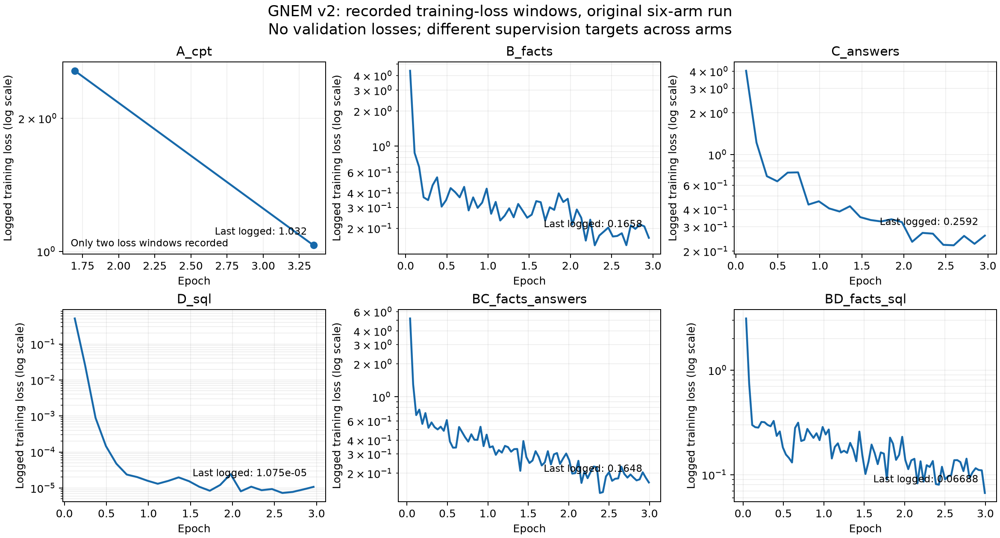
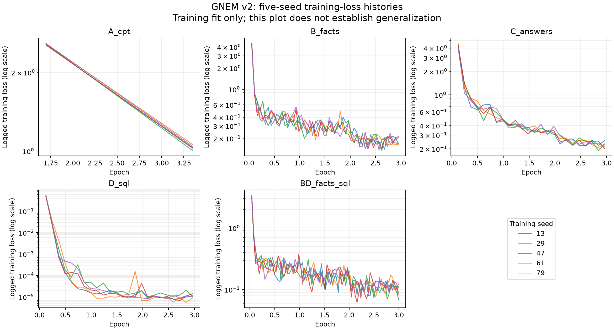

**Independent verification of GNEM fine-tuning — 11 September 2026**

**Verdict.** The completed main v2 runs have credible evidence of actual optimization: decreasing training losses, nonzero gradients, completed optimizer-step counts, and matching log/adapter-manifest timestamps and dataset hashes. This does not establish generalization, optimal stopping, or complete numerical reproducibility. A newly reconstructed truncation failure invalidates interpretation of the intended 0/5/25-example SQL dose comparison until it is rerun correctly.

This report supersedes the earlier repository review’s limited statement that historical loss/mask behavior had not been independently inspected. It adds raw-log extraction and a CPU-only reconstruction of the documented preprocessing. V3 has no completed training artifacts in this checkout.

**Scope and evidence strength**

- Read every one of the 71 historical `.train.log` files under `v2-frozen-reference` (`b18313ae593995e8d415880603b3d355dd695ebd`). There are 54 logs with both a final training summary and completion metadata.
- Of these, 43 logs belong to v2 run directories: 34 completed and 9 incomplete. The completed v2 set comprises six original arms, three dose arms, and five seeds for each of A/B/C/D/BD. Earlier and smoke experiments are recorded separately in the CSV; they are not pooled into the v2 tables.
- Parsed raw loss dictionaries, gradients, learning rates, entropy, token accuracy, progress bars, and final metadata; cross-checked the nine original/dose runs against the separately archived adapter manifest. All nine timestamps and dataset hashes match.
- Inspected the trainer at all four commits named by completed v2 logs. The trainer source is byte-identical across those commits. Nine completed v2 runs report a dirty worktree, so a commit alone cannot prove the exact uncommitted runtime state; the 25 seeded runs report clean worktrees.
- Reconstructed assistant labels using the pinned Qwen tokenizer and the official source/template for the recorded TRL 1.9.2 version. This is a source-based reconstruction, not a replay of retained training batches.
- No adapter tensors, optimizer states, actual `training_args.bin`, or `trainer_state.json` are available in the current checkout/frozen file tree. Their historical hashes/configuration snapshots are available. I did not run a model forward/backward pass or recompute loss from checkpoint weights.

**Actual logged losses: original six-arm run**

The source run is `run_v2_20260812_170423`. These are the values printed by the trainer, with the precision preserved by the log. “First” means the first logging window after training began, not an evaluation of the untouched base model. “Last logged” is the last periodic logging window, not a fresh loss measurement on the final checkpoint. `train_loss` is the trainer’s aggregate over the run.

| Arm | First logged loss | Last logged loss | Whole-run `train_loss` | Optimizer steps | Epochs | Runtime | Peak allocated VRAM |
|---|---:|---:|---:|---:|---:|---:|---:|
| A_cpt | 2.561 | 1.032 | 1.642 | 24 | 4 | 5.32 min | 36.43 GB |
| B_facts | 4.393 | 0.1658 | 0.3769 | 549 | 3 | 20.77 min | 35.99 GB |
| C_answers | 4.032 | 0.2592 | 0.5717 | 243 | 3 | 9.33 min | 36.06 GB |
| D_sql | 0.5116 | 1.075e-05 | 0.02215 | 243 | 3 | 43.53 min | 36.43 GB |
| BC_facts_answers | 5.201 | 0.1648 | 0.3979 | 792 | 3 | 29.98 min | 36.06 GB |
| BD_facts_sql | 3.114 | 0.06688 | 0.2207 | 792 | 3 | 63.92 min | 36.50 GB |

A has only two periodic loss observations, at epochs 1.696 and 3.348, because packing reduces the run to 24 optimizer steps and logging occurs every 10 steps. Its final summary is at epoch 4. Do not draw a detailed convergence trajectory from two observations. For B/C/D/BC/BD, the last logged windows are near, but not exactly at, the final epoch.

[PDF loss curves](loss_curves.pdf) · [All loss events as CSV](loss_history.csv) · [All runs as CSV](runs.csv)

**Other recorded training metrics**

The following metrics come from each arm’s last periodic logging window, so the loss, accuracy, entropy and gradient norm refer to the same logged interval/event. Gradient norm is a logged measurement, not proof of every individual parameter update.

| Arm | Last logged epoch | Token accuracy | Entropy | Gradient norm | Learning rate |
|---|---:|---:|---:|---:|---:|
| A_cpt | 3.348 | 79.03% | 1.069 | 0.5137 | 1.121e-05 |
| B_facts | 2.951 | 95.23% | 0.1788 | 0.3474 | 8.715e-08 |
| C_answers | 2.964 | 92.78% | 0.2498 | 2.101 | 7.147e-08 |
| D_sql | 2.964 | 100.00% | 0.0001093 | 0.0008152 | 7.147e-08 |
| BC_facts_answers | 2.993 | 95.31% | 0.1643 | 1.028 | 3.765e-09 |
| BD_facts_sql | 2.993 | 97.57% | 0.1024 | 0.1226 | 3.765e-09 |

**What the loss means**

The intended objective is causal next-token negative log-likelihood/cross-entropy. Conceptually, for supervised positions M:

`L = -(1 / |M|) × sum(log p(correct next token | preceding tokens))`

A uses language-model loss on packed plain passages. B/C/D/BC/BD use assistant-only supervision: system/user content supplies context but is masked from direct loss. The reconstructed template also supervises assistant-boundary text, including a newline and end-of-turn tokens; counting only the answer’s ordinary words does not reproduce the loss-token budget.

The recorded TRL version defaults to `chunked_nll`, a memory-efficient implementation of next-token cross-entropy. The source constructs labels with `-100` for masked positions, truncates to the first 1,024 tokens, and drops examples left fully masked. [Official TRL 1.9.2 trainer source](https://github.com/huggingface/trl/blob/v1.9.2/trl/trainer/sft_trainer.py) and [configuration source](https://github.com/huggingface/trl/blob/v1.9.2/trl/trainer/sft_config.py).

Lower loss means the model predicts its supervised training tokens more confidently. Token accuracy here is teacher-forced next-token accuracy on supervised tokens, not the fraction of complete questions answered correctly. A near-zero D loss therefore does not mean 100% business-question accuracy. [TRL metric definitions](https://huggingface.co/docs/trl/sft_trainer).

Loss values across arms are not a common quality leaderboard: A predicts entire passages, B predicts factual answers, and D predicts strongly patterned SQL. Target length, difficulty and repetition differ. The very low D loss is consistent with close fitting of its training queries. Loss alone cannot distinguish useful learning from overfitting.

**Hyperparameters and training behavior**

| Setting | Recorded or source-supported value |
|---|---|
| Base model | Qwen/Qwen2.5-14B-Instruct |
| Recorded base revision | `cf98f3b3bbb457ad9e2bb7baf9a0125b6b88caa8` |
| Adaptation | Plain LoRA; bf16 base; not 4-bit QLoRA |
| LoRA rank / alpha / dropout | 32 / 64 / 0.05 |
| Target modules | q_proj, k_proj, v_proj, o_proj, gate_proj, up_proj, down_proj |
| Adapter parameter count | Historical header audit records 137,625,600 trainable adapter parameters; tensors were not available for a new inspection |
| Learning rate | 0.0001 starting schedule scale; cosine schedule, 0.03 warmup ratio |
| Optimizer | paged_adamw_8bit |
| Microbatch / accumulation | Defaults of 1 / 8, consistent with the run driver and observed step totals |
| Effective batch | 8 training sequences per full optimizer step on one GPU; final batches may be smaller |
| Max sequence length | 1,024 |
| Epochs | A: 4; other main arms: 3 |
| Checkpointing | Gradient checkpointing enabled, non-reentrant |
| Loss logging | Every 10 optimizer steps |
| Model checkpoint saving | `save_strategy="no"` during training; final adapter saved afterward |
| In-training validation | No `eval_dataset` supplied; no `eval_loss` found in any of the 71 logs |
| Seed sweep | 13, 29, 47, 61, 79 for A/B/C/D/BD; original unsuffixed runs use the driver’s default seed 13 |

The base revision is recorded after loading, but `from_pretrained` is called without an explicit `revision=` argument. The metadata identifies the intended snapshot; future reproducible execution should pin it in the actual load call. Training configuration fields not printed per run, such as microbatch/accumulation, are supported by source and matching step counts rather than recovered serialized runtime arguments.

**Reconstructed assistant-mask checks**

All original B/C/D/BC/BD examples retain supervised tokens at 1,024 tokens. The plain and training chat templates render identical token sequences; the training template adds loss-span annotations. B is reconstructed from the byte-exact recovered source described below.

| Arm | Input examples | Retained examples | Dropped | Supervised tokens per dataset pass after truncation | Expected steps over 3 epochs |
|---|---:|---:|---:|---:|---:|
| B_facts | 1464 | 1464 | 0 | 25,877 | 549 |
| C_answers | 647 | 647 | 0 | 14,980 | 243 |
| D_sql | 647 | 647 | 0 | 17,639 | 243 |
| BC_facts_answers | 2111 | 2111 | 0 | 40,857 | 792 |
| BD_facts_sql | 2111 | 2111 | 0 | 43,516 | 792 |
| D_sql_k0 | 672 | 647 | 25 | 17,639 | 243 |
| D_sql_k5 | 672 | 647 | 25 | 17,639 | 243 |
| D_sql_k25 | 672 | 647 | 25 | 17,639 | 243 |

These counts are reconstructed non-ignored labels after the causal shift, before batching. They are not the logs’ `num_tokens`, which includes input context. For D, 632,795 retained input tokens per pass × 3 = 1,898,385, consistent with the rounded log value `1.898e+06`. Its supervised count is only 17,639 per pass. This explains why long-schema SQL training costs substantially more time than direct-answer training despite similar completion-token budgets.

**Critical finding: the 0/5/25 SQL dose did not survive preprocessing**

The intended experiment adds 25 county examples to D, with 0, 5, or 25 recursive examples. All 25 additions in each arm begin their supervised assistant span beyond the 1,024-token limit. Under the recorded preprocessing, truncation removes every supervised token from those examples, and the fully-masked filter removes them.

The effective token-and-label arrays for D_sql, D_sql_k0, D_sql_k5, and D_sql_k25 have exactly the same SHA-256 in the reconstruction:

`0eef3c69a84e9b42a33846a343d54373bb3570843f8068f986651972e2449aca`

The lost rows are indices 647–671 (zero-based), exactly the 25 additions. Every arm retains the original 647 D examples. This is corroborated by all four successful logs reporting 243 optimizer steps and approximately 1.898 million input tokens. A complete 672-example dataset with the documented batch/epoch settings would instead yield 252 steps.

Consequences: do not interpret this comparison as evidence that adding 5 or 25 recursive examples had no effect. The recorded setup did not deliver the intended extra supervision. Model output differences can still arise from numerical/run variability, but cannot be attributed to a dose whose examples disappear. This finding concerns the dose manipulation; it does not by itself invalidate the separate observation that an existing model can generate recursive SQL.

Confidence is high because source reconstruction, dataset hashes, mask identity, step totals and processed-token totals agree. The remaining limit is that the installed historical wheel and saved batch tensors were not preserved here; the reconstruction uses the official source for the recorded version and the pinned cached tokenizer.

Fix: choose a length budget that retains every complete example, assert zero unexpected dropped/partially supervised targets after preparation, and log the retained count and supervised construct exposure. Current reconstructed dose sequences reach 1,196 tokens; 2,048 would fit these particular files, but calculate the budget for the final actual templates. Rerun the intended dose comparison if it remains scientifically relevant; geographic dose arms are retired from active v3.

**Archived B data corruption: original training bytes recovered**

The frozen-reference standalone `train_B_facts.jsonl` has malformed JSON at lines 15–17. Its current SHA-256 is `1bdf37b47350ae00f169de395a7dae5ea9ef05d103926ec318288945abc48ca7`, which differs from every completed v2 B run. That file cannot be used to reproduce those runs.

I recovered the first 1,464 lines from both BC and BD. Independently, both copies match the exact logged training hash:

`377a5bc74e5fd73089f3a291528ae5163d58d0831406841d644303f169139494`

The recovered file is [recovered_train_B_facts.jsonl](recovered_train_B_facts.jsonl). No archived or active dataset was overwritten. This establishes an archival corruption problem, not evidence that the completed B runs consumed malformed JSON. The other completed v2 dataset hashes agree with the frozen-reference files.

**Five-seed results: whole-run training loss**

These statistics are independently calculated from the raw logs for seeds 13, 29, 47, 61, 79. They measure variation in fitting the training data, not generalization. BC has no five-seed set here.

| Arm | Seed 13 | Seed 29 | Seed 47 | Seed 61 | Seed 79 | Mean ± sample SD |
|---|---:|---:|---:|---:|---:|---:|
| A_cpt | 1.634 | 1.66 | 1.636 | 1.639 | 1.657 | 1.6452 ± 0.0123167 |
| B_facts | 0.3767 | 0.3679 | 0.3768 | 0.3732 | 0.3698 | 0.37288 ± 0.00401086 |
| C_answers | 0.5716 | 0.6039 | 0.5979 | 0.5917 | 0.5822 | 0.58946 ± 0.0128107 |
| D_sql | 0.02223 | 0.0226 | 0.02363 | 0.02084 | 0.02353 | 0.022566 ± 0.00113518 |
| BD_facts_sql | 0.2211 | 0.2247 | 0.2157 | 0.2224 | 0.2254 | 0.22186 ± 0.00385396 |

**What cannot be concluded from the preserved evidence**

- No validation-loss curves exist. We cannot calculate a train/dev loss gap, identify the minimum validation loss, or conclude that three epochs was optimal. Falling training loss is not a substitute.
- No intermediate checkpoints were saved by this driver. The final adapter was used; there is no demonstrated best-checkpoint selection by dev loss.
- Adapter hashes and header-derived metadata are preserved, but actual weights and optimizer states are absent here. A fresh held-out loss, parameter-delta/gradient inspection, optimizer-state audit, or exact replay would require those artifacts and a suitable model runtime.
- The driver defaults to deleting per-seed adapters after evaluation unless retention is explicitly requested. This reduces post-hoc verifiability.
- Eight incomplete v2 dose attempts show CUDA out-of-memory failures; another ends after four training steps without a completion record. These were excluded from completed-run statistics. They must not be reported as successful runs.
- An extremely low SQL training loss does not validate generated SQL on novel multi-operation questions or resolve the earlier identified gold/grading issues.

**Recommended corrections before the next training run**

1. Correct the dose interpretation in research notes; rerun only if that experiment is still needed.
2. Preserve the recovered B artifact with its proven hash and retain the corrupt archived file as evidence rather than silently replacing history.
3. Log raw and retained example counts, input tokens, supervised tokens, truncation counts, and actual construct exposure after all preprocessing. Assert the intended intervention reaches the loss labels.
4. Add a fixed dev set, periodic dev loss and execution-based business metrics, checkpoint retention, and an explicit dev-based selection rule. Keep final test evaluation separate.
5. Save actual training arguments, trainer state/log history, per-run package versions, effective chat template, label-mask samples, model revision, dataset hashes, seed, and adapter tensors.
6. Keep all per-seed adapters. Pin the base revision in the load call and record hardware/software settings needed to interpret numerical reproducibility.
7. Judge success using correct complete answers to realistic held-out questions alongside training diagnostics.

**Evidence and reproduction files**

- `extract_training_evidence.py`: reads historical Git objects and creates the complete run/loss tables and verbatim v2 logs.
- `check_token_lengths.py`: tokenizer-only length screening; its B result intentionally records the malformed archive.
- `reconstruct_masks.py`: uses the recovered B bytes and the official TRL training template to reconstruct masks and effective datasets.
- `mask_reconstruction_summary.json` and `mask_details_*.json`: per-arm and per-row label/truncation evidence.
- `log_manifest_crosscheck.json`: original-run log metadata versus archived adapter-manifest metadata.
- `historical_sources/`: trainer code at the recorded revisions, configuration snapshots, and adapter-manifest extract.
- `library_sources/`: downloaded official TRL 1.9.2 source and Qwen templates; local copies are evidence and are not imported into active v3 training.
- `raw_logs/`: verbatim copies of all 43 v2 training logs, including failures.
- `runs.csv`, `loss_history.csv`, corresponding JSON, and PNG/PDF plots: complete audit outputs.

The plotting dependencies were installed into `/tmp/gnem-audit-plot`, not the project environment. No model was trained, no saved model was evaluated, and no original experiment code/data was modified.
